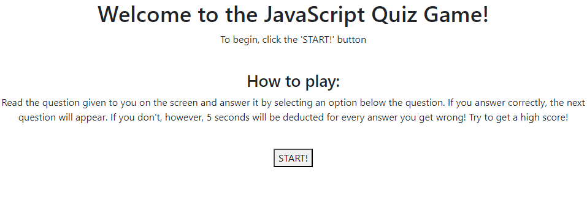

# javascript_quiz

## Description

This app allows you to test basic knowledge of Javascript while also allowing you to save a score in Local Storage.

## Installation

N/A

## Usage

To use this app, read the directions presented on page load. Click the `START!` button when ready, then read and answer the questions as prompted. When finished, enter your initials and click the `Submit` button. The `Reload` button takes you back to the start to take the quiz again!

## Credits

N/A

## License

Please refer to the LICENSE in the repo.